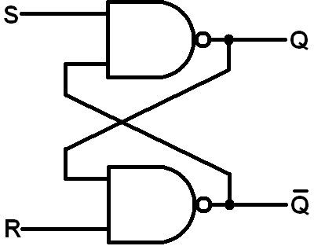
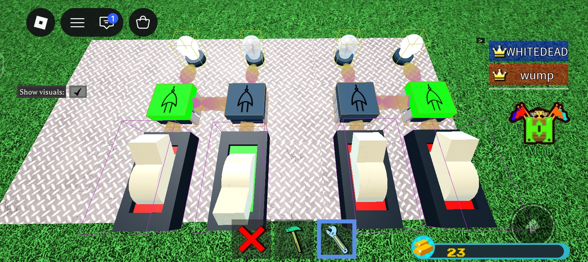

# 💾 BABFT: 1-Bit SR Flip-Flop Latch

A simple 1-Bit memory latch (SR Flip-Flop) built in **Roblox: Build a Boat for Treasure** using logic blocks and basic tools.

---

## 🛠️ Required Tools & Components

* **Tools Needed**: Screwdriver Tool & Wrench Tool
* **Components**: Switches, Logic Blocks, and Light Bulbs

---

## 📐 Logic Circuit Diagram

---

## 🚀 How to Build (Step-by-Step)

1. **Place Components**: Lay out the switches, logic blocks, and light bulbs on your plot exactly as shown in the picture.
2. **Configure Gate Modes**: Use the **Screwdriver Tool** on the logic blocks to enable both **OR** and **NOT** modes on both sides.
3. **Wire the Circuit**: Use the **Wrench Tool** to connect all components, making sure to cross-connect the circuit boards to each other on both sides.

That's it! You now have a functional **SR Flip-Flop** memory cell in BABFT.

---

## 👤 Author
Developed by **THEE9CYPTED**

